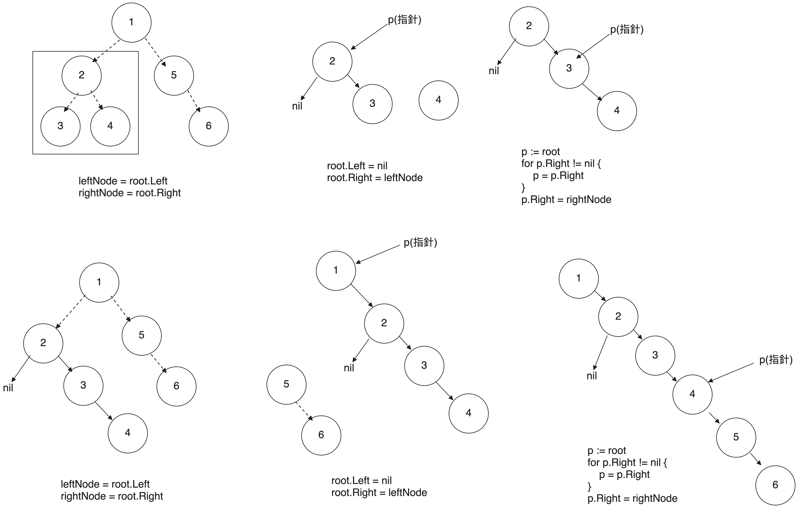

# Intuition

給定一個二元樹，我們需要將其轉換為 `Linked List` 的形式。這個鏈表應該按照 `前序遍歷 (Preorder Traversal)` 的順序排列。

本題的關鍵在於如何 `原地修改` 二元樹的結構，使其變成一條從根節點開始的 Linked List，且保持前序遍歷的順序。
<!-- Describe your first thoughts on how to solve this problem. -->

# Approach

- 遞迴將左子樹與右子樹展平（flatten）。
- 暫存 `左子樹` 與 `右子樹`。
- 讓當前節點的 `右子樹指向原本的左子樹`，並將 `左子樹設為 nil`。
- 遍歷 `新的右子樹的最右端`，並將 `原本的右子樹接到該節點的右側`。



<!-- Describe your approach to solving the problem. -->

# Complexity

- Time complexity
    - O(n)，其中 n 是二元樹的節點數。

<!-- Add your time complexity here, e.g. $$O(n)$$ -->

- Space complexity
    - O(n)，其中 n 是二元樹的節點數，call stack。

<!-- Add your space complexity here, e.g. $$O(n)$$ -->

# Code

```go
package leetcode

type TreeNode struct {
	Val   int
	Left  *TreeNode
	Right *TreeNode
}

func flatten(root *TreeNode) {
	if root == nil {
		return
	}

	flatten(root.Left)
	flatten(root.Right)

	leftNode := root.Left
	rightNode := root.Right
	root.Left = nil
	root.Right = leftNode

	p := root
	for p.Right != nil {
		p = p.Right
	}
	p.Right = rightNode
}
```

```java
public class TreeNode {
    int val;
    TreeNode left;
    TreeNode right;

    TreeNode() {
    }

    TreeNode(int val) {
        this.val = val;
    }

    TreeNode(int val, TreeNode left, TreeNode right) {
        this.val = val;
        this.left = left;
        this.right = right;
    }
}

class Solution {
    public void flatten(TreeNode root) {
        if (root == null) {
            return;
        }

        flatten(root.left);
        flatten(root.right);

        TreeNode leftNode = root.left;
        TreeNode rightNode = root.right;
        root.left = null;
        root.right = leftNode;

        TreeNode p = root;
        while (p.right != null) {
            p = p.right;
        }
        p.right = rightNode;
    }
}
```